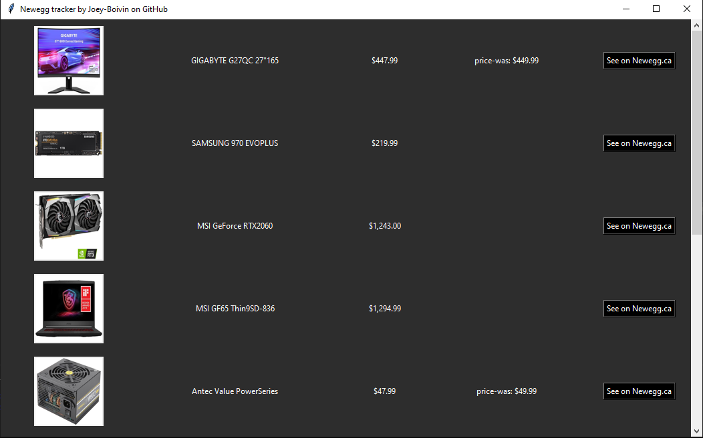

# Newegg-tracker

This is a simple tracker for items listed on [Newegg](https://www.newegg.ca/).

## Dependencies

- [beautifulsoup4](https://pypi.org/project/beautifulsoup4/)
- [requests](https://pypi.org/project/requests/)

## Installation

1. Fork and clone the repository
2. Install the dependencies as stated above
3. The data-example.json file exists to give the reader an idea of how the data is structured. It is not necessary.

## First use

To track your first item, retrieve the url extention that follows https://www.newegg.ca/

> python main.py N --add your-url-extension

To open the help menu:

> python main.py -h

## License

This software is licensed under the [MIT Liscence](LICENSE.md)
